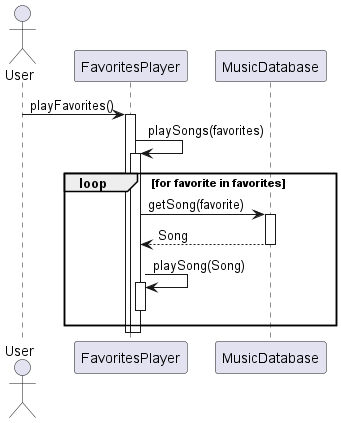

# Contents

1. January 8: [TypeScript Fundamentals](#typescript-fundamentals)
2. January 13: [TypeScript Fundamentals Continued](#typescript-fundamentals-continued)
3. January 15: [React](#react)
4. January 27: [UML](#uml)
5. January 29: [Architecture](#architecture)
6. February 3: [Observer Pattern](#observer-pattern)

## Typescript Fundamentals
<!--{-->

- JavaScript doesn't have explicit types and tries to convert as needed.
    - This is very error prone
- TypeScript has explicit types and so catches these errors early
    - You don't actually have to explicitly say the type though, you can make the compiler infer it from the assignment

- Other values:
    - <i>null</i> is a type of object that is not initialized
    - <i>undefined</i> is a value (like int or boolean) that is declared but not assigned

- We can declare something to be multiple types with the `|`
    - i.e. `let myThing: Type1 | Type2 | null = null`

- With numbers:
    - <i>number</i> is all types of numbers
        - We can use `_` to separate big numbers into chunks to help with readability
    - <i>bigint</i> is a bigger number
        - i.e. `let big: bigint = 123456789n`

- <i>enum</i> gives certain values only
    - Each value (regardless of type) gets a value (0, 1, 2,...) with which to be referred

- For objects:
    - We don't need to declare a class
    - We can just declare an object:
        - i.e. `let stock = {sym: 'AAPL', price: 137.23}`
            - The types are inferred here
    - We can always add new variables to the object too
    - If we assign `stock` a different value later, it will only be happy if the same number of values and of the same type are used
        - If we want one value (property) to be optional, we just include `?` after the type name. This means we have to declare the type explicitly

- Aliases:
    - We can use aliases to assign types to keep things compact:

```ts
type Age = number
type Person = {
    name: string
    age: Age
}
let driver: Person {
    name: "James"
    age: 55
}
```

- We can make two types of types:
    - Union: `type OneOrTwoOrBoth = TypeOne | TypeTwo`
        - We can be of TypeOne, of TypeTwo, or Both of them
    - Intersect: `type OneAndTwo = TypeOne & TypeTwo`
        - We have to have something with all attributes from both (except the optionals)
- Tuples:
    - We have to be explicit here, if we aren't, the thing is inferred as an array
        - i.e. `let a: [number, number] = [2, 4]`
    - These are arrays that are a fixed size

- Any (type is `any`):
    - This is to tell TypeScript to back off, that you've got it
    - This is helpful if you are doing something with a library or something that doesn't have TypeScript types
    - Other than something like that, you probably shouldn't use `any` as a type

- Unknown (type is `unknown`):
    - This won't let you do anything until you assign the thing a type
    - Here's how you use it:
        - i.e. `if (typeof value === 'number') {let n = (value as number);}`

- Object (type is `object`):
    - This is not like the JavaScript `Object`, it is just anything that is non-primitive:
        - Object
        - Array
        - etc.

<!--}-->

## TypeScript Fundamentals Continued
<!--{-->

- Different function declarations:
    - `function greet1(param: type, param: type): returnType {function block;}`
    - `let greet2 = function(param: type, param: type): returnType {function block;}`
    - `let greet3 = (param: type, param: type): returnType => {function code;}`
    - `let greet4 = (param: type, param: type): returnType => function code` -> If there is only one line of code, you can do it here without a return or {}
- All of these are called the same way: `greet#(val, val)`

- We can use optional parameters: (at any place in the function declaration)
    - i.e. `function(param1: type, param2?: type, param3: type)`
- We can use default parameters: (only at the end of the declaration)
    - i.e. `function(param1: type, param2: type, param3: type = value)`

- Rest parameters examples:
```ts
# pass in a whole list of things at once
function sumNumbers(...numbers: numbers[]): number {
    return numbers.reduce((total, n) => total + n, 0)
}

# make some things fixed in size, and then take the rest
function buildName(first: string, ...restOfName: string[]) {
    return firstName + " " + restOfName.join(" ")
}
```

- Function Types are pretty much the function declaration over again, but just of the types this time
    - i.e. for `function greet(name: string, value: string): string {return 'hello ' + name + ', the number is ' + value}`, the type is `(name: string, value: string) => string`
- 

<!--}-->

## React
<!--{-->

## React intro

- React has these benefits:
    - It has a component-based architecture (good for modular code)
    - It has a virtual DOM, which mirrors the webpage DOM
    - It has unidirectional data flow (as a design)
    - It has React Native, which is for mobile applications
- The DOM is how we make webpages and has the following features:
    - It has a tree structure representing the webpage
    - It can be manipulated by scripts, so it is dynamic and live
    - It can work in multiple different browsers
- Contrasting older vs. newer webpages:
    - Older would:
        - Load a page
        - Send a request to the server upon interaction
        - Receive and display a new page
    - Newer do:
        - Load a page
        - Request only necessary data
        - Update the page without hitting the server
- Something like ternary operators:
    - You can use: `boolExpr() && thingYouWantToRender()`
    - If false, the second part won't "evaluate" (won't render)
    - If true, it will

## Routing

- Routing is to help us learn from the URL where to go, since we don't have separate HTML pages with an SPA
- Routing is pretty much a big switch statement. We can use different comparisons to see where to go:
    - Path: `path="/pathName"`
    - Index: You can put `index` in the component and then use `<Navigate to="/path"/>`
    - Dynamic: `path="/path/:variablePath"`
    - Optional segments: `path="/path:optionalPath?"`
    - Splat: `path="/user/*"`
    - Wildcard: `path="*"`, catches anything (put at the end)
- If you want to have something that is the same in every page, put it outside of the `<BrowserRouter>`
    - If you want something in a lower level route that appears in its sub pages, you can nest `<Route>`s
        - You have the main Route element, and somewhere in it you have an `<Outlet>`
        - You define other Routes as children of the parent Route
        - Whichever you have chosen gets populated into that `<Outlet>` element
- All of this depends on the location (as specified in the URL), so how do we change the URL
    - We can use these from `'react-router-dom'`
        - `const navigate = useNavigate(); navigate("/path")`
        - `<Link to="/path">LinkName</Link>`
        - `<NavLink>` -> may add bolding to the links
        - Fun fact: don't use / and the path name will be appended, else it will create an entirely new link

<!--}-->

## UML
<!--{-->

- We do modeling to help us know what we are building
- We do it too to help us understand and learn about an existing system
- We can use them to document our system as well

## Class diagrams

- We have classes
    - This doesn't have to be an actual class in the code, but could be just things that have the same functionality
    - It looks like:
        - A box with the name of the class at the top
        - A section for attributes
            - i.e. `- age: int` (private, name, type)
            - We can have multiplicity (shown after the type)
        - A section for methods
            - i.e. `+ print()` (public, name(args))
- We have objects:
    - Same show as a Class, but we have an underline
    - This is more for a sequence diagram actually...
    - We can do `name: Class` if the object is part of a class
- Relationships:
    - We have associations:
        - arrow from one class to another
            - There is a descriptor above the arrow telling what the relation is (the arrow tells you from which object you can get to the other, may be unidirectional)
            - The multiplicity is at either side of the arrow 
                - i.e. a child has [1] mother, but a mother can have [*] children

            - You can label the role at either end of the arrow to tell what the role of the object in that relationship is
    - We can use diamonds:
        - Hollow is an aggregation: 
            - i.e. a Person is a subpart of a Company
            - We can use a comb to put many thing in the one diamond
        - Filled in is a composition:
            - i.e. a Car is composed of Car parts
            - The mulitplicity is always 1 on the part of the diamond
            - Kind of implies that the one thing only exists to be part of the other
    - Generalization/Specialization
        - Arrow pointing from specialized version to generalized version with a hollow head
    - Dependencies: these are good for design level
        - Dotted line from the one to the other it is dependent on
        - If you have shown an association, you're probably fine not to use this
- You can have an association class
    - It is a box, like a Class, that connects to the association line between the other classes

- Here is a sequence diagram



<!--}-->

## Architecture
<!--{-->

- <b>Software Architecture</b>: large scale organization into packages, subsystems, layers (can span multiple applications)
- <b>Layer</b>: A rough grouping of classes, packages, or subsystems that share a responsibility for a significant piece of the system
- <b>Package</b>: a group of classes or other software artifacts

- What does the architecture define?
    - The major subsystems (these themselves can be broken down into sub-subsystems)
    - Responsibilities of the subsystems
    - Dependencies between them
    - Interface between them
    - What the communication pattern is
    - The technologies to implement them
        - OS, language, UI, database, etc.
    - The hardware of the system
- Implementing the Architecture
    - You can develop the subsystems in parallel
        - This is where testing with Mockito and such it helpful
    - You want the interfaces to be well defined
        - Let the designers have as much freedom as possible
        - Keep the ripple effect from being too large (or maybe there won't be change...)

### Layered Architecture

- This is one type of architecture (the one we will use in Tweeter), but just one type
- The general idea
    - There are higher layers that call on the lower levels
    - The lower levels do not depend on the higher levels
- There are two types:
    - <b>Strict</b>: one layer can ONLY depend on the one below it
        - Seen a lot in network communication
    - <b>Relaxed</b>: a layer can depend on any of the ones below it
        - Seen a lot in business applications

- Implementation
    - Determine the number of layers
    - Name the layers and give them responsibilities
    - Define the interface for each layer (so we know how they communicate)
    - Error handling:
        - Make sure the error returned is appropriate for the level it is at
        - Don't let the low-level errors leak into the higher layers
            - Transform the error at the layer it is first caught and turn it into something the layer above can understand and that is appropriate for its level of abstraction


<!--}-->

## Observer Pattern
<!--{-->

- Abstract Subject: knows about the observer interface, but not the actual observer classes
    - notify()
    - register(Object)
- Concrete Subject:
    - setProp(prop)
    - getProp()

- <Interface> Observer:
    - update()
- Concrete Observer:
    - update()

- The interface is to give us functions we have to implement, making it so we can replace any type of concrete class to do those things
    - There is no actual code implementation here
- The abstract class is to have some functionality that we want in many classes but don't want to repeat it
    - We have to inherit this abstract class


<!--}-->

## Default
<!--{-->

- 

<!--}-->


